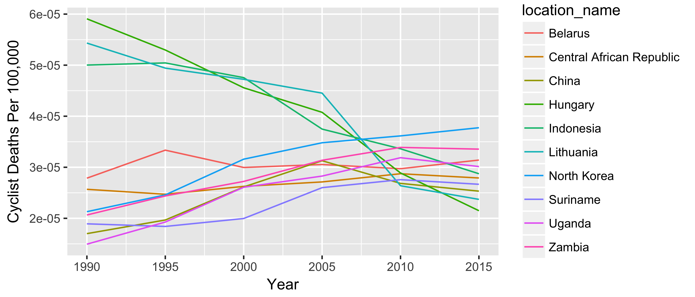

```{r setup, include=FALSE}
knitr::opts_chunk$set(echo = TRUE)

library(data.table)
library(shiny)
library(plotly)
library(formattable)
library(DT)


## Pull GBD2015 global cycling deaths
# data <- get_outputs(topic = "cause", gbd_round_id = 3, location_id = "lvl3", year_id = c(1990, 1995, 2000, 2005, 2010, 2015), sex_id = c(1,2), cause_id = 691, metric_id = c(1,3))

data <- readRDS("input_data/rmarkdown_data.rds")

## Format numbers to uncertainty intervals, without rounding to a digit
format_num <- function(x) format(round(x, 0), decimal.mark = ".", big.mark = ",")
data[metric_name == "Number", ui_val := paste0(format_num(val), " (", format_num(lower), ", ", format_num(upper), ")")]

## Convert rate to rate per 100,000, display to three rounded digits
format_rate <- function(x) format(round(x * 100000, 3), decimal.mark = ".", big.mark = ",")
data[metric_name == "Rate", ui_val := paste0(format_rate(val), " (", format_rate(lower), ", ", format_rate(upper), ")")]
```

## R Markdown

This is an R Markdown document. Markdown is a simple formatting syntax for authoring HTML, PDF, and MS Word documents. For more details on using R Markdown see <http://rmarkdown.rstudio.com>.

When you click the **Knit** button a document will be generated that includes both content as well as the output of any embedded R code chunks within the document. You can embed an R code chunk like this:

```{r summary_chunk}
summary(data$val)
```

You can display a formatted table like so. We use echo = FALSE to hide the code underlying the data.

```{r chn_death_table, echo = FALSE}
knitr::kable(data[location_name == "China" & year_id == 1990 & metric_name == "Number", list(sex, ui_val)],
             format = "markdown",
             caption = "All-age Cyclist Road Injury deaths in China, 1990")
```


You can embed numbers like so:
There were `r length(unique(data$location_name))` locations studied. 

For more complicated operations, you can first invisibly create a data.table, then perform operations off of it.

```{r top10_2010_deaths, echo = FALSE}
top10_2010_deaths_male <- data[year_id == 2010 & sex == "Male" & metric_name == "Number"]
setorder(top10_2010_deaths_male, -val)
top10_2010_deaths_male <- top10_2010_deaths_male[1:10]

top10_2010_deaths_female <- data[year_id == 2010 & sex == "Female" & metric_name == "Number"]
setorder(top10_2010_deaths_female, -val)
top10_2010_deaths_female <- top10_2010_deaths_female[1:10]
```

The 10 countries with the most male cyclist road deaths in 2010 were `r paste(top10_2010_deaths_male$location_name, collapse = ", ")`. The 10 countries with the most female cyclist road deaths in 2010 were `r paste(top10_2010_deaths_female$location_name, collapse = ", ")`. Vietnam was surprisingly high on this list, with `r top10_2010_deaths_male[location_name == "Vietnam", ui_val]` male deaths and `r top10_2010_deaths_female[location_name == "Vietnam", ui_val]` female deaths.

## Including Plots

You can also embed plots, for example:

```{r top10_female_plot, echo=FALSE}
top10_changes_female <- data[location_name %in% unique(top10_2010_deaths_female$location_name) & sex == "Female" & metric_name == "Number"]
ggplot(top10_changes_female) +
  geom_line(aes(x = year_id, y = val, color = location_name)) +
  xlab("Year") +
  ylab("Cyclist Deaths") +
  ggtitle("Total Female Cyclist Deaths: Top 10 Countries in 2010")
```

A more advanced plot might also have a caption and customizable width and height:

```{r, top10_male_plot, echo=FALSE, fig.width=4, fig.height=1, fig.cap="Total Male Cyclist Deaths: Top 10 Countries in 2010"}
top10_changes_male <- data[location_name %in% unique(top10_2010_deaths_male$location_name) & sex == "Male" & metric_name == "Number"]
ggplot(top10_changes_male) +
  geom_line(aes(x = year_id, y = val, color = location_name)) +
  xlab("Year") +
  ylab("Cyclist Deaths")
```

If a plot takes a long time to render, you can embed a PNG of the plot (for example, a GBD Map). Here is the code used to generate the PNG in the first place:

```{r, top10_male_plot_png, eval=FALSE}
top10_rates_male <- data[year_id == 2010 & sex == "Male" & metric_name == "Rate"]
setorder(top10_rates_male, -val)
top10_rates_male <- top10_rates_male[1:10]

top10_rates_male <- data[location_name %in% unique(top10_rates_male$location_name) & sex == "Male" & metric_name == "Rate"]
png("input_data/male_death_rate.png")
ggplot(top10_rates_male) +
  geom_line(aes(x = year_id, y = val, color = location_name)) +
  xlab("Year") +
  ylab("Cyclist Deaths Per 100,000")
dev.off()
```

And here is the PNG (sourced directly from the PNG file)



You can also use packages to make your output #fancy. This table uses the sparkline package to add sparklines to the table.

```{r chn_death_formattable, echo = FALSE}
## Reshape to wide by deaths, and add sparklines
wide_data <- data[metric_name == "Number" & sex == "Male", list(year_id, location_name, val)]
wide_data[, year := as.character(paste0("Deaths ", year_id))]
wide_data[, year_id := NULL]
wide_data <- dcast(wide_data, location_name ~ year, value.var = "val")

## Create a comma-separated list of numbers, which will be fed into the sparkline
wide_data[, `Year Trend` := paste(`Deaths 1990`, `Deaths 1995`, `Deaths 2000`, `Deaths 2005`, `Deaths 2010`, `Deaths 2015`, sep = ",")]

setnames(wide_data, "location_name", "Country")

## Decide which column to feed to the sparkline data object called sparkSeries
col_defs <- list(list(targets = 7, render = JS("function(data, type, full){ return '<span class=spark>' + data + '</span>' }")))

## Decide how to format the sparkline display -- width in pixels
line_string <- "width:100, type: 'line', lineColor: 'black', fillColor: '#ccc', highlightLineColor: 'orange', highlightSpotColor: 'orange'"

## Create a sparkline based on the sparkSeries data object
myspark <- JS(paste0("function (oSettings, json) {\n  $('.spark:not(:has(canvas))').sparkline('html', { ", line_string, " })}"), collapse = "")

d1 <- datatable(wide_data, 
                rownames = FALSE, 
                options = list(columnDefs = col_defs, fnDrawCallback = myspark))
d1$dependencies <- append(d1$dependencies, htmlwidgets:::getDependency("sparkline"))
d1
```

Latex is fairly straightforward \[ distance = \frac{n_{match}}{n_{admit}+n_{discharge}-n_{match}} \]

To add a bibliography, see <http://rmarkdown.rstudio.com/authoring_bibliographies_and_citations.html>. You simply need to add a .bib file which can be exported from Zotero or other citation managers. From there, you can use brackets to cite the source and add it to your printed citation list. 

```{eval=FALSE}
XYZ study analyzed the relative proportion of cyclist deaths [@sourceXYZ].
```

To standardize your citation display, you can add a csl file. In total, the following code pieces need to be added to the header part of your .Rmd:

```{r eval=FALSE}
bibliography: mybib.bib
csl: lancet-style.csl
```
